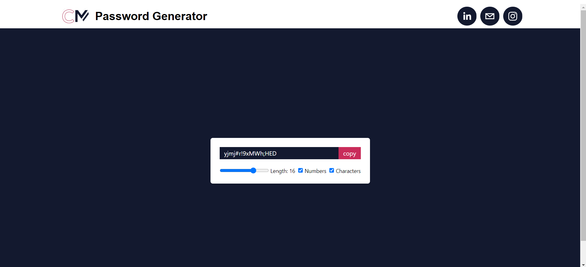

# Password Generator Application

Introducing our Password Generator Application, a robust tool designed to generate the password for the user.Our primary objective is to genrate strong password based on the user input such as password length numbers are alowed or not special char are allowed or not.

## Technologies / Tools used for building this app includes

# Demo :movie_camera:

 View live preview [here]().

## Contact
If you have any suggestions on what to improve in <em>Weather Application </em> and would like to share them, feel free to drop mail to implement your own ideas 

Chintan Marvaniya - chintanmarvaniya985@example.com

Project Link: [https://github.com/chintanmarvaniya1/Password-Generator](https://github.com/chintanmarvaniya1/Password-Generator)
